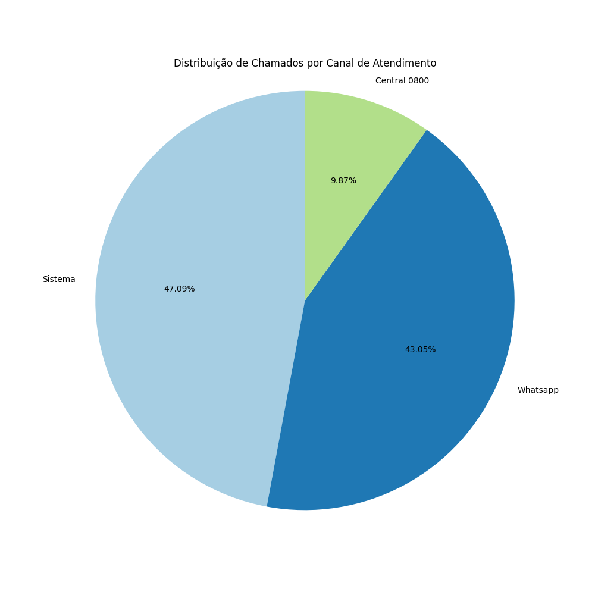

# Projeto de Análise de Dados

# Análise de Chamados - Resumo dos Gráficos

## 1. Evolução do Número de Chamados ao Longo do Tempo
 

 
- **Dados**: Tendência temporal (ano/mês) da quantidade de chamados.  
  - **Observação**: Eixos não especificados, mas sugere análise sazonal ou crescimento.  

## 2. Quantidade de Chamados por Equipamento
 

- **Destaques**:  
  - "Computador" lidera (≈100 chamados), seguido por "Monitor" (≈60).  
  - Periféricos como "Mouse" e "Teclado" têm volumes menores (≤40).  

## 3. Quantidade de Chamados por Grupo Técnico

 

- **Distribuição**:  
  - "Suporte n2" é o mais demandado (≈175 chamados).  
  - "Bancada" e "Equipe Regional" têm volumes significativos (≈100-150).  
  - "Estagiário" e outros com menor participação.  

## 4. Quantidade de Chamados por Mês
 

- **Picos**:  
  - Mês 6 teve o maior volume (83 chamados).  
  - Meses 3-4 apresentam crescente (18-25 chamados), com a máxima atingida entre os meses 5-6 (57-83 chamados).  

## 5. Quantidade de Chamados por Status
 

- **Status predominante**: "Estoque" (135 chamados).  
  - "Atribuído" (50), "Fechado" (28), e "Pendente" (10) completam a lista.  

## 6. Top 5 Localizações com Mais Chamados

- **TOP 5 demanda**, com "LOC_001", "LOC_005" e "LOC_003" são destacadas.  

## 7. Distribuição por Canal de Atendimento
 

- **Canais principais**:  
  - "Sistema" (47.09%) e "Whatsapp" (43.50%) dominam.  
  - "800" tem participação menor (9.42%).  

### Conclusões Preliminares:  
- Computadores são os equipamentos mais problemáticos.  
- Suporte N2 é o grupo técnico mais sobrecarregado.  
- Junho (Mês 6) apresenta pico de demanda.  
- Chamados em "Estoque" indicam possível gargalo na resolução.  
- Canais digitais ("Sistema" e "Whatsapp") são os preferidos para abertura de chamados.  
